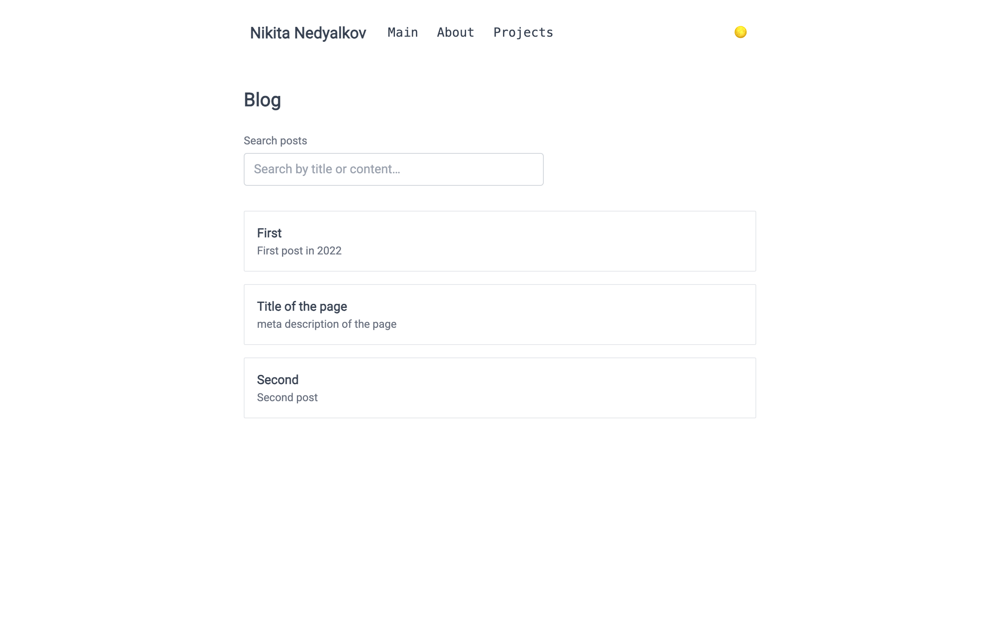
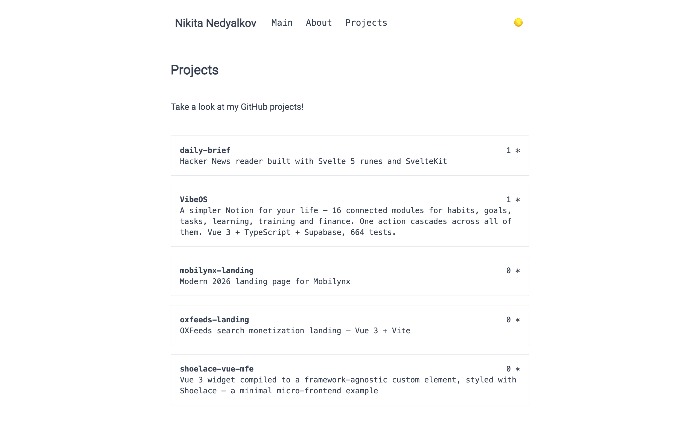

# Nikita Nedyalkov — portfolio

A small personal site: what I work on, a curated set of project case studies,
and a blog written in Markdown with client-side search.



## What is on it

- **Projects** — a curated set of case study cards (the problem, what shipped,
  stack, demo and source links), not a dump of every public repository.
- **Blog** — posts are Markdown files under `content/blog`, rendered by Nuxt
  Content. The index searches titles, descriptions and post bodies as you type
  and highlights the matches; there is no search service, the posts are already
  on the page.
- **About** — one Markdown file, so editing it is editing text rather than a
  component.
- **Light and dark**, remembered between visits.



## Stack

| | |
|---|---|
| Framework | Nuxt 3.13 with the Nuxt 4 compatibility flag (`future.compatibilityVersion: 4`) |
| Content | `@nuxt/content` 2 — Markdown for the blog and the about page |
| Styling | Tailwind CSS with the typography plugin |
| Theme | `@nuxtjs/color-mode`, class-based |
| Tests | Vitest with `@nuxt/test-utils` |
| Output | `nuxt generate` — a static site, 21 prerendered routes |

No component framework beyond Tailwind: an earlier version used Vuetify and it
was removed, so the markup here is plain elements and utility classes.

## Running it

```bash
npm install
npm run dev        # http://localhost:3000
```

```bash
npm test           # route smoke tests against a real Nuxt server
npm run generate   # static build into .output/public
npx serve .output/public
```

Node 22.

## Tests and CI

`tests/routes.test.ts` boots a real Nuxt server and asks for `/`, `/projects`
and `/blog` — the cheapest test that would catch a broken build, a broken route
or a component that throws on render. CI runs a clean `npm ci`, the tests and a
static generate on every push and pull request.

## Deploy

The output of `nuxt generate` is a plain static site — any static host will do:

```bash
npm run generate
# then deploy .output/public
```

## Known limits

- The projects page shows a handful of curated projects, not the full list of
  repositories — most of what I work on is private anyway.
- The blog has a handful of posts, and two of them are still placeholders from
  the original template.
- There is no CMS: posting means committing a Markdown file.
